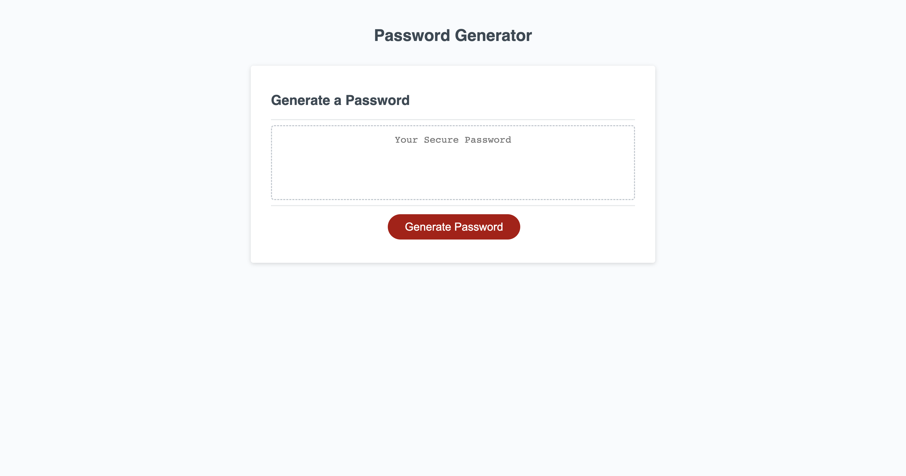
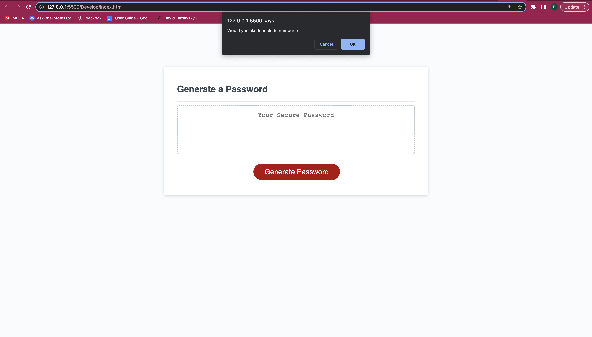
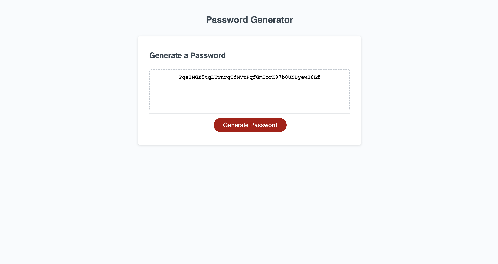

# module_3_assignment

## prompt
This week's Challenge requires you to create an application that an employee can use to generate a random password based on criteria they've selected. This app will run in the browser, and will feature dynamically updated HTML and CSS powered by JavaScript code that you write. It will have a clean and polished user interface that is responsive, ensuring that it adapts to multiple screen sizes.

## Description
This program generates a random password based on the user's preferences. When the "Generate Password" button is clicked, the user will be faced with 4 prompts, one after the other, asking the length of the password and what type of characters the user wants to include. Once all prompts have been answered, a random password will be generated. 

